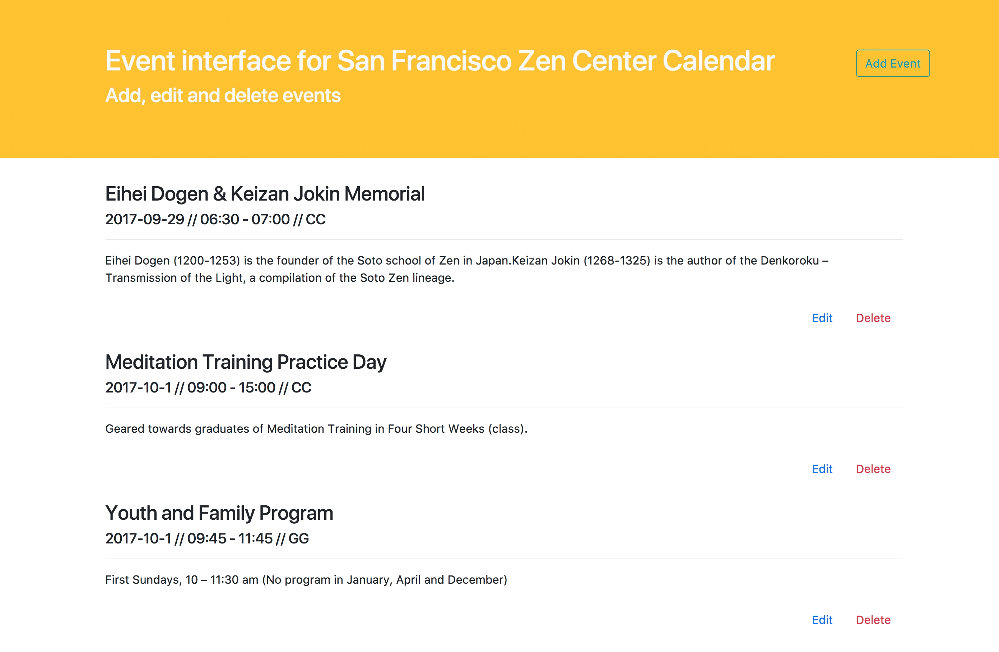

# SFZC_event_interface
>Admin interface to post, edit and delete events on SFZC calendar 

This is a full-stack project providing an admin view of events in the San Francisco Zen Center calendar. 
It uses Node JS to communicate with a PostgreSQL database. 

Users can:

* view all activities in a list view
* edit and delete existing activities in the database
* add new activites to the database
* fill in details with a pre-populated form and options

> [Demo here](http://sfzc-admin-interface.surge.sh/)
(beware: first time loading is slow)

## Next Steps 

* Connect the admin interface to the calendar view
* Automatically populate recurring events
* Filter list view by center, event type and date
